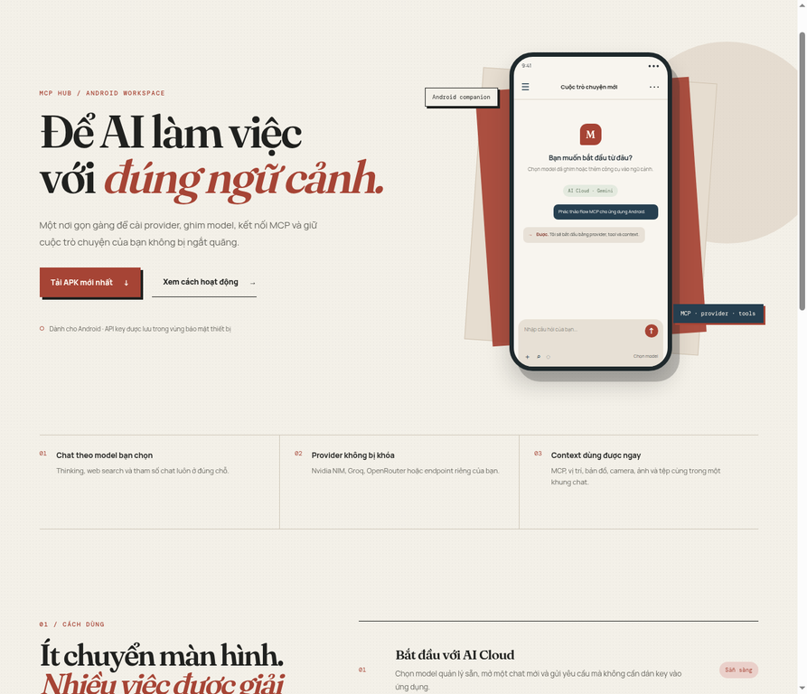
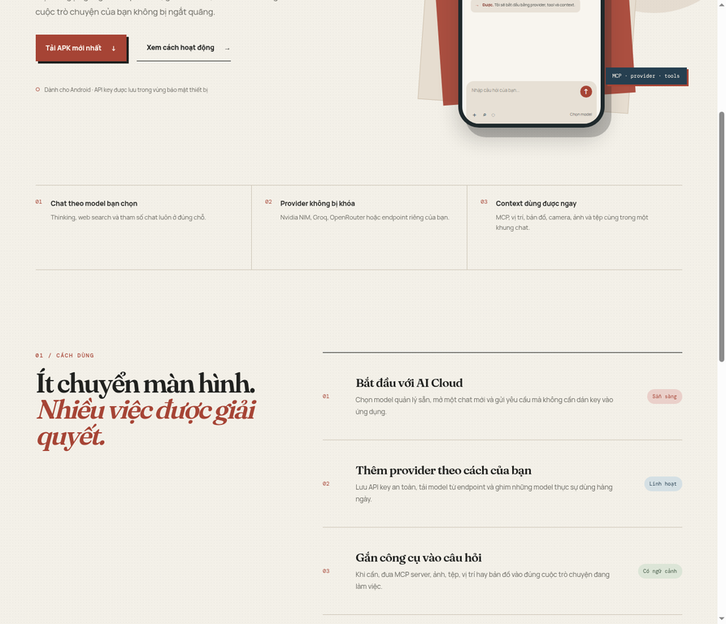
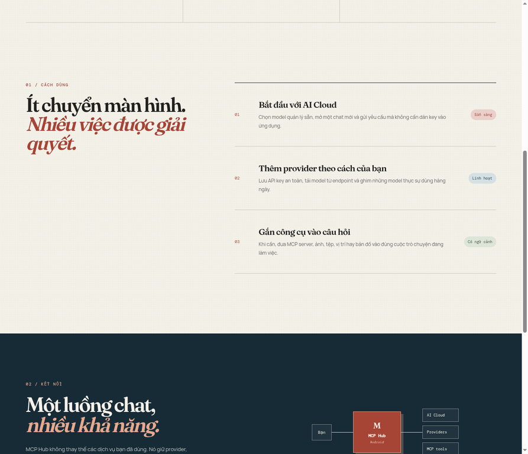
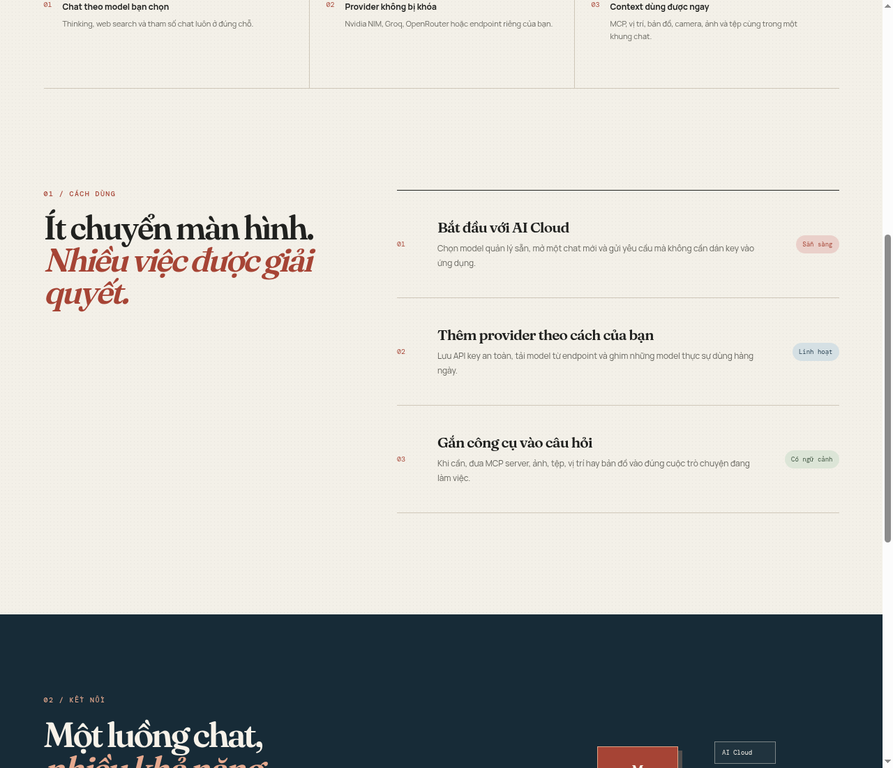
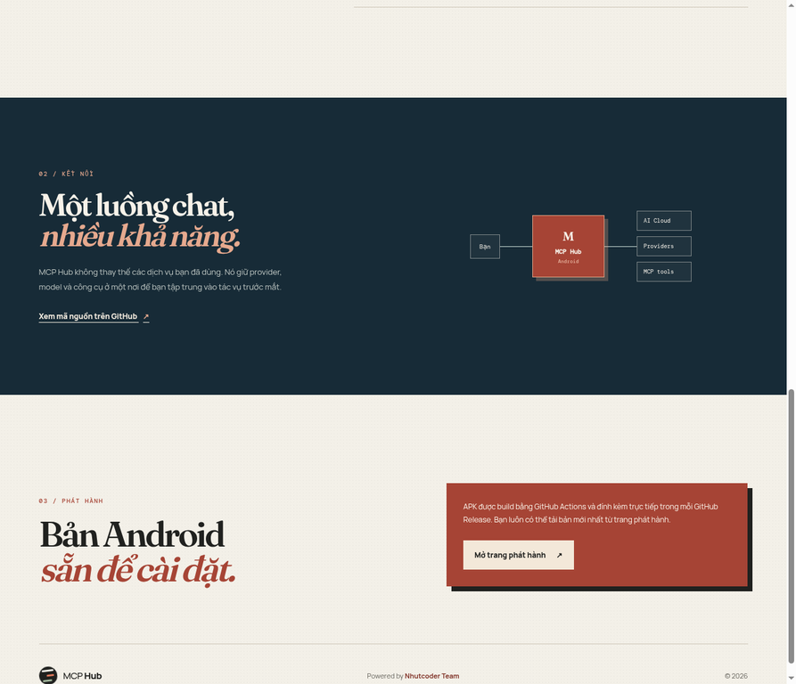
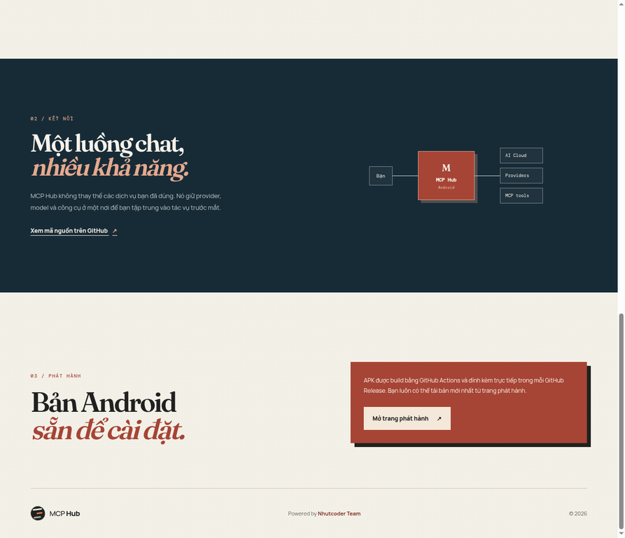

# MCP Hub

**MCP Hub** là ứng dụng Android tập trung cho việc quản lý provider AI, model đã ghim, server Model Context Protocol (MCP) và cuộc trò chuyện AI. Ứng dụng hỗ trợ NVIDIA NIM, Groq, OpenRouter, provider tuỳ chỉnh và AI Cloud được bảo vệ.

> Phiên bản phát hành hiện tại: [V1.0.12](https://github.com/nhut0902-pr/mcp-hub-android/releases/tag/v1.0.12). API key của AI Cloud không nằm trong APK.

## Tải ứng dụng

Bạn có thể tải bản Android mới nhất từ [GitHub Releases](https://github.com/nhut0902-pr/mcp-hub-android/releases). Ứng dụng cũng có chức năng kiểm tra phiên bản, tải APK và mở trình cài đặt trực tiếp từ màn **About**.

## Hình ảnh website

| Hero | Điểm nổi bật |
|---|---|
|  |  |
| Workflow | Workflow và kiến trúc |
|  |  |
| Kiến trúc kết nối | Phát hành Android |
|  |  |

## Khả năng chính

| Nhóm | Nội dung |
|---|---|
| **Provider & model** | Lưu API key trong SecureStore, đồng bộ model từ endpoint, tìm kiếm và ghim nhiều model. |
| **AI Cloud** | Chat với nhãn người dùng **Nhutbot 1.0 Flash**, không đưa API key vào thiết bị. |
| **MCP** | Cấu hình Streamable HTTP, SSE hoặc stdio; API key/Bearer token và OAuth token được lưu bảo mật trên thiết bị. |
| **Chat** | Thinking, web search, ảnh, tệp, camera, vị trí, bản đồ, archived chats và thông báo lỗi theo provider/model. |
| **Cập nhật** | Kiểm tra release, tải APK và mở Android installer từ trong ứng dụng. |

## Thiết lập MCP

MCP Hub phân biệt rõ cấu hình profile và kết nối thực tế. Với server HTTP, ứng dụng kiểm tra URL bằng MCP `initialize`, hiển thị kết quả thành công hoặc lỗi HTTP/timeout/xác thực. Với OAuth, server có thể trả `401` cùng metadata để client bắt đầu cấp quyền; chuẩn MCP dùng OAuth 2.1 cho remote HTTP, còn STDIO thường lấy credential từ môi trường. [1] [2]

| Dịch vụ | Endpoint | Transport | Xác thực |
|---|---|---|---|
| **Notion** | `https://mcp.notion.com/mcp` | Streamable HTTP | OAuth; SSE fallback có sẵn. [3] |
| **GitHub** | `https://api.githubcopilot.com/mcp/` | HTTP | OAuth hoặc GitHub PAT qua Bearer. [4] |
| **Slack** | `https://mcp.slack.com/mcp` | Streamable HTTP | Confidential OAuth với Slack app đã đăng ký. [5] |
| **Linear** | `https://mcp.linear.app/mcp` | Streamable HTTP | OAuth + DCR, Bearer token hoặc Linear API key. [6] |
| **Stripe** | `https://mcp.stripe.com` | Streamable HTTP | OAuth hoặc restricted API key qua Bearer. [7] |
| **Supabase** | `https://mcp.supabase.com/mcp` | Streamable HTTP | OAuth + DCR; CI dùng PAT Bearer khi cần. [8] |
| **Cloudflare** | `https://mcp.cloudflare.com/mcp` | Streamable HTTP | OAuth hoặc Cloudflare API token qua Bearer. [9] |

> Chỉ kết nối MCP mà bạn tin cậy. Với dữ liệu nhạy cảm, ưu tiên endpoint read-only, API key giới hạn quyền và luôn xem lại tool call trước khi xác nhận.

## Phát triển

```bash
pnpm install --frozen-lockfile
pnpm dev
pnpm test
```

Website giới thiệu và các thành phần dịch vụ được tách thành thư mục riêng, không chạy cùng source Expo.

## Giấy phép và mã nguồn

Từ V1.0.11, MCP Hub được phân phối theo **GNU General Public License v3.0**. Bản đầy đủ nằm trong [`COPYING`](COPYING); mã nguồn tương ứng và hướng dẫn build theo release tag nằm tại [`SOURCE_CODE.md`](SOURCE_CODE.md). Thông báo cho terminal runtime được lưu ở [`modules/mcp-hub-runtime/THIRD_PARTY_NOTICES.md`](modules/mcp-hub-runtime/THIRD_PARTY_NOTICES.md).

## Tài liệu tham khảo

[1]: https://modelcontextprotocol.io/docs/2026-07-28/tutorials/security/authorization "MCP Authorization tutorial"
[2]: https://modelcontextprotocol.io/specification/draft/basic/authorization "MCP Authorization specification"
[3]: https://developers.notion.com/guides/mcp/get-started-with-mcp "Notion MCP"
[4]: https://docs.github.com/en/copilot/how-tos/provide-context/use-mcp-in-your-ide/set-up-the-github-mcp-server "GitHub MCP Server"
[5]: https://docs.slack.dev/ai/slack-mcp-server "Slack MCP Server"
[6]: https://linear.app/docs/mcp "Linear MCP Server"
[7]: https://docs.stripe.com/mcp?locale=en-GB "Stripe MCP"
[8]: https://supabase.com/docs/guides/ai-tools/mcp "Supabase MCP"
[9]: https://developers.cloudflare.com/agents/model-context-protocol/cloudflare/servers-for-cloudflare/ "Cloudflare MCP servers"
